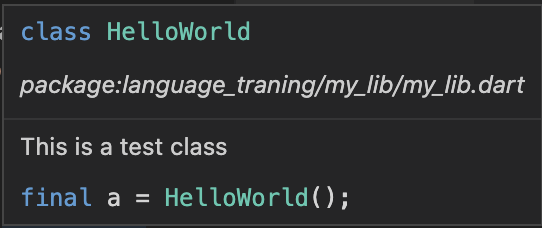

# Flutter Coding Rules

## Definitions

<table>
    <tr>
        <td width="40%"> <b>UpperCamelCase</b></td>
        <td width="60%"> Capitalize the first letter of each word, including the first. etc: <b>MyClass</b> </td>
    </tr>
    <tr>
        <td> <b>lowerCamelCase</b> </td>
        <td> Capitalize the first letter of each word, except the first which is always lowercase, even if it’s an acronym. etc: <b>studentList</b> </td>
    </tr>
    <tr>
        <td> <b>lowercase_with_underscores</b> </td>
        <td> Use only lowercase letters, even for acronyms, and separate words with _. etc: <b>home_screen.dart</b> </td>
    </tr>

</table>

## 1. Naming 

<table>
<tr>
<td width="40%">

Name of files, packages, directories, import prefixes use [lowercase_with_underscores](#definitions) format. </td>
<td width="60%">

```dart
my_package
└─ lib
   └─ file_system.dart
   └─ slider_menu.dart

import 'dart:math' as math;
```

</td>
</tr>
<tr>
<td>

Name of classes, extensions, enum types use [UpperCamelCase](#definitions) format.
</td>
<td>

```dart
class SliderMenu { ... }

extension MyFancyList<T> on List<T> { ... }

enum MyType { ... } 
```

</td>
</tr>
<tr>
<td>

Name of constant, variables, enum variables use [lowerCamelCase](#definitions) format.

</td>
<td>

```dart
const defaultTimeout = 1000;

final List<Student> studentList = [];

enum MyType { 
    typeOne,
    typeTwo
 } 
```

</td>
</tr>
<tr>
<td>Use prefix <b>_</b> for private identifiers (classes, variable,...) </td>
<td>

```dart
class _PrivateClass {...}

final _privateVariable = true;
```

</td>
<tr>
<td>Use <b>_</b> or <b>__</b>  for unused callback parameters</td>
<td>

```dart
futureOfVoid.then((_,__) {
  print('done.');
});
```

</td>
</tr>
<tr>
<td><b>DON’T</b> use prefix letters.</td>
<td>

```dart
const defaultTimeout = 10; //good
const kDefaultTimeout = 10;  //bad
```

</td>
</tr>
</tr>
<td>
Capitalize acronyms and abbreviations longer than two letters like words.
</td>
<td>

```dart
class HttpConnection {} //good
class HTTPConnection {} //bad
```

</td>
</tr>
<tr>
<td> Starting a boolean variable or property with a question words like can, is, should,...</td>
<td>

```dart
final isConnected = true;
final shouldConfirm = true;
final canResize = true;
```
</td>
</tr>
</table>

## 2. Styling

<table>
<tr>
<td width="40%">

Import packages by following order and sort each section by alphabetically.

```dart
dart: 
package:
relative imports (../foo.dart)
```
</td>
<td width="60%">

```dart
// good
import 'dart:a';
import 'dart:b';

import 'package:a/a.dart';
import 'package:b/b.dart';

import 'a.dart';
import '../b.dart';

// bad
import 'dart:a';
import 'package:a/a.dart';
import 'dart:b';
import '../b.dart';
import 'package:b/b.dart';
import 'a.dart';
```
</td>
</tr>
<tr>
<td>

Use curly braces for all flow control statements. <br>
**Exception**: When you have an if statement with no else clause and the whole if statement fits on one line, you can omit the braces.

</td>
<td>

```dart
// good
if (isTrue) {
  print('true');
}
if (arg == null) return true;

// bad
if (isTrue) 
  print('true');
```
</td>
</tr>
</table>

## 3. Comment

Doc comments are especially handy because [dart doc](https://dart.dev/tools/dart-doc) parses them and generates beautiful doc pages from them. <br>
You don’t have to document every single library, top-level variable, type, and member, but you should document most of them.

<table>
<tr>
<td width="40%">Format comments like sentences and capitalize the first word.</td>
<td width="60%">

```dart
// In case no item in list, we do nothing
if (!hasItems) return false;
```
</td>
</tr>
<tr>
<td>Use <b>///</b> to document members and types</td>
<td>

```dart
/// The number of item in array.
int get length => ...
```
</td>
</tr>
<tr>
<td>You can use markdown on comments.</td>
<td>

```dart
/// This is a test class
///
///```dart
///final a = HelloWorld();
///```
class HelloWorld {}
```
It will generate the document like this



</td>
</tr>
</table>


## 4. Usage

<table>
<tr>
<td width="40%">

If you choose to use **library** and **part of** to describe a libraries with related files, with part files you should specify the library by path, not name.
</td>
<td width="60%">

```dart
library my_lib;
part './lib_a.dart';

// The part file should use the library file’s URI:
part of '../../my_library.dart';//good

// Not the library name:
part of my_library;//bad
```
</td>
</tr>
<tr>
<td>
<b>DON’T</b> import libraries that are inside the src directory of another package.
The src directory under lib is specified to contain libraries private to the package’s own implementation, they are free to make sweeping changes to code under src without it being a breaking change to the package.
</td>
<td>
For example, say your directory structure looks like this:

```dart
package_a
└─ lib
   └─ private_lib.dart

// private_lib.dart:
library private_lib;

//we WON'T import private_lib into any our files

```
</td>
</tr>
<tr>
<td><b>DON’T</b> allow an import path to reach into or out of lib</td>
<td>
For example, say your directory structure looks like this:

```dart
my_package
└─ lib
   └─ api.dart
   test
   └─ api_test.dart

// And say api_test.dart imports api.dart in two ways:
import '../lib/api.dart'; //bad, don’t use /lib/ in import paths.
import 'package:my_package/api.dart'; //good
```
</td>
</tr>
<tr>
<td>When an import does not reach across lib, prefer using relative imports. They’re shorter.</td>
<td>
For example, say your directory structure looks like this:

```dart
my_package
└─ lib
   ├─ src
   │  └─ stuff.dart
   │  └─ utils.dart
   └─ api.dart
   test
   │─ api_test.dart
   └─ test_utils.dart

// lib/api.dart:
import 'src/stuff.dart';
import 'src/utils.dart';

// lib/src/utils.dart:
import '../api.dart';
import 'stuff.dart';

//test/api_test.dart:
import 'package:my_package/api.dart'; 
import 'test_utils.dart'; 
```
</td>
</tr>
</table>
