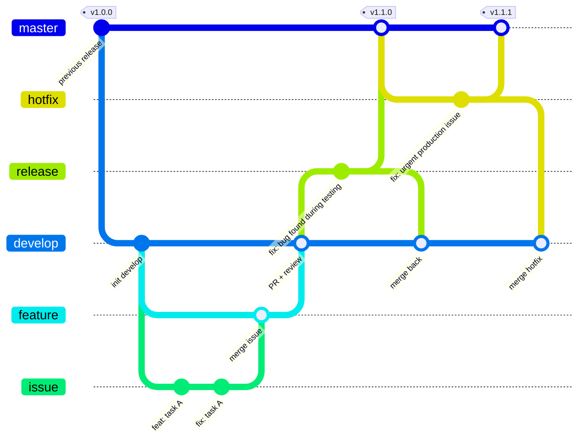

# Git Workflow Guideline

This document defines a consistent Git workflow for Briswell Vietnam projects, covering branching, branch naming, commits, force pushes, and releases.

The goal is to standardize branch usage, ensure that code is reviewed before release, and clearly define each role's responsibilities from the start of a project.

## Table of Contents

[**Mandatory Rules**](#mandatory-rules)

[**1. Roles**](#1-roles)

[**2. Branch Workflow**](#2-branch-workflow)

- [2.1 Branch Overview](#21-branch-overview)
- [2.2 Standard Development](#22-standard-development)
- [2.3 Emergency Fixes (Hotfix)](#23-emergency-fixes-hotfix)

[**3. Branch Naming Rules**](#3-branch-naming-rules)

[**4. Commit Rules**](#4-commit-rules)

- [4.1 Commit Message Structure](#41-commit-message-structure)
- [4.2 Change Types (type)](#42-change-types-type)
- [4.3 Writing Rules](#43-writing-rules)
- [4.4 Examples](#44-examples)

[**5. Force Push Rules**](#5-force-push-rules)

[**6. Tags and Versions**](#6-tags-and-versions)

[**7. Environments**](#7-environments)

[**8. Appendix**](#8-appendix)

- [8.1 Example Commands for Devs](#81-example-commands-for-devs)
- [8.2 Initial Git Configuration](#82-initial-git-configuration)
- [8.3 Automated Commit Checks (commitlint)](#83-automated-commit-checks-commitlint)
- [8.4 References](#84-references)

---

## Mandatory Rules

| # | Rule |
|---|---|
| 1 | **Do not push directly** to `master` or `develop`. Changes must be merged through a PR. |
| 2 | **Branch names:** use `issue/<redmine-id>` and `feature/<redmine-id>`. Follow the [branch naming rules](#3-branch-naming-rules) for Release and Hotfix branches. Example: `feature/123456`. |
| 3 | **Commits:** follow [Conventional Commits](https://www.conventionalcommits.org/en/v1.0.0/) and BWV's additional rules in [section 4](#4-commit-rules). Example: `feat(auth): add login form` with the Redmine ticket URL at the end of the message. |
| 4 | **Force pushes:** prohibited on shared branches. Allowed only on personal `issue/*` branches or personal `feature/*` branches for small tasks without an Issue branch, subject to [section 5](#5-force-push-rules). Use `--force-with-lease --force-if-includes`. |
| 5 | **Releases:** after merging into `master`, create a `vX.Y.Z` tag. |

> **PR** is the term used throughout this document. It refers to a Pull Request on GitHub or a Merge Request on GitLab.

<p align="right">(<a href="#table-of-contents">back to top</a>)</p>

---

## 1. Roles

| Role | Responsibilities |
|---|---|
| **Developer (Dev)** | Develop code on `issue/*` or a personal Feature branch under the small-task exception, test the changes, follow the commit rules, and push. |
| **Feature Owner** | Create `feature/*` branches, merge `issue/*` into `feature/*`, check integration, and open a PR from `feature/*` to `develop`. |
| **Code Reviewer** | Review and approve PRs into `develop`, and review code changes on `release/*` and `hotfix/*`. Merge into `develop` and check integration after merging. |
| **Maintainer** | Create `release/*` and `hotfix/*` branches at the PM's request. Merge into `master` and `develop`, create tags, and configure branch protection. |
| **Project Manager (PM)** | Define how work is divided into Feature branches, request releases/hotfixes, and approve branch naming exceptions. |
| **Dev Leader** | Lead technical work and handle Git incidents or exposed secrets. |

- Roles must be clearly assigned at the start of a project. One person may hold multiple roles.

<p align="right">(<a href="#table-of-contents">back to top</a>)</p>

---

## 2. Branch Workflow

### 2.1 Branch Overview

| Branch | Purpose | Created From | Merged Into | Merged By |
|---|---|---|---|---|
| `master` | Released code | Exists from the start | — | — |
| `develop` | The latest completed and reviewed code | `master` (initial creation only) | — | — |
| `feature/*` | Integrate tasks for a feature, or implement a small task on a personal Feature branch | `develop` | `develop` (through a PR) | Code Reviewer |
| `issue/*` | Develop a Redmine task when work needs to be split within a Feature | `feature/*` | `feature/*` | Feature Owner |
| `release/*` | Prepare and validate a release | `develop` (at the PM's request) | `master` + `develop` (through PRs) | Maintainer |
| `hotfix/*` | Fix an urgent production issue | `master` (at the PM's request) | `master` + `develop` (through PRs) | Maintainer |



### 2.2 Standard Development

1. **Create a Feature branch:** The Feature Owner creates `feature/*` from `develop`.
2. **Develop a task:** The Dev creates `issue/*` from `feature/*`, develops the code, and follows the [commit rules](#4-commit-rules).
3. **Integrate the task:** After testing the changes, the Dev pushes `issue/*`. The Feature Owner merges it into `feature/*` and checks integration.
4. **Review:** When the feature is complete, the Feature Owner opens a PR from `feature/*` to `develop`. The Code Reviewer reviews, approves, and merges it.
5. **Verify on develop:** The Code Reviewer checks integration after merging. The people responsible for the Feature/Issue test again in the develop environment.
6. **Prepare a release:** At the PM's request, the Maintainer creates `release/vX.Y.Z` from `develop` and deploys a build to staging for validation.
7. **Release:** After validation and review are complete, release to production. The Maintainer opens PRs from `release/*` to `master` and from `release/*` to `develop`, merges them, and creates a `vX.Y.Z` tag.

**Small tasks without an Issue branch:** A Dev may work directly on a personal `feature/<redmine-id>` branch created from `develop` if they are the only person working on the task. When the task is complete, the Dev tests the changes and opens a PR into `develop`. The Code Reviewer still reviews, approves, and merges it as described in steps 4–5. If others work on the branch or use it as the base for other work, it becomes a shared Feature branch and force pushes are prohibited.

**Notes for `release/*` branches:**

- Staging and production builds for the same release must use **the same source commit** on the Release branch and differ only in environment configuration.
- Debug features must be **OFF** in staging and production.
- If a bug or specification change is identified during validation, or a change currently being developed on `develop` is needed, make the change on `release/*`, then merge it back into `develop`.

### 2.3 Emergency Fixes (Hotfix)

Use this workflow when a production issue requires an immediate fix.

1. At the PM's request, the Maintainer creates `hotfix/*` from `master`.
2. The Dev fixes the issue and commits on `hotfix/*` (usually `fix: ...`). The Code Reviewer reviews the changes.
3. Build from the same source commit using each environment's configuration (debug **OFF**) and validate the builds.
4. After the release, the Maintainer merges into `master` (creates a tag and increments PATCH, for example, `v1.1.0` → `v1.1.1`) and into `develop`.
5. Verify behavior in the develop environment.

> If there is an open `release/*` branch that has not been merged, also merge the hotfix into that branch so the next release retains the fix.

<p align="right">(<a href="#table-of-contents">back to top</a>)</p>

---

## 3. Branch Naming Rules

Use [Conventional Branch](https://conventionalbranch.org/) as a reference and apply the BWV naming rules below. The `issue/` prefix and Redmine task numbers are BWV-specific conventions.

`<redmine-id>` is the task number in Redmine (Redmine Task number).

| Branch | Format | Example |
|---|---|---|
| Master | `master` | `master` |
| Develop | `develop` | `develop` |
| Feature | `feature/<redmine-id>` | `feature/123456` |
| Issue | `issue/<redmine-id>` | `issue/123456` |
| Refactor | `refactor/<redmine-id>` | `refactor/123456` |
| Release | `release/vX.Y.Z` | `release/v1.2.0` |
| Hotfix | `hotfix/<redmine-id>` (or a name agreed with the Project Manager) | `hotfix/123456` |

**Rules:**

- Use `/` to separate the branch type from its identifier. Branch name components may contain only lowercase letters `a-z`, digits `0-9`, and hyphens `-`. Dots `.` are allowed only in the version of a `release/*` branch.
- Do not use uppercase letters, `_`, spaces, Vietnamese characters with diacritics, or consecutive hyphens `--`. Descriptions must not start or end with `-`.
- If a Redmine ticket is not yet available for a hotfix, the branch creation date may be used, for example, `hotfix/20260925`.
- MAJOR, MINOR, and PATCH numbers in Release branch names must not have leading zeros. For example, use `release/v1.2.0`, not `release/v01.2.0`.
- Agree on any alternative naming with the PM at project kick-off, document it in the project's README, and follow the character rules above.

| ✅ Correct | ❌ Incorrect | Reason |
|---|---|---|
| `issue/123456` | `Issue/123456` | Uppercase letters |
| `feature/123456` | `feature-123456` | Missing `/` |
| `release/v1.2.0` | `release/1.2` | Missing `v` and the PATCH number |

Regex for validating the default branch naming format (for CI or Git hooks):

```text
^(master|develop|(feature|issue|refactor|hotfix)/[0-9]+|release/v(0|[1-9][0-9]*)\.(0|[1-9][0-9]*)\.(0|[1-9][0-9]*))$
```

The regex checks that Feature/Issue/Refactor branches use task numbers, Hotfix branches have numeric identifiers, and Release branches have all three version components without leading zeros. Projects with naming exceptions agreed with the PM must update their validation rules accordingly.

<p align="right">(<a href="#table-of-contents">back to top</a>)</p>

---

## 4. Commit Rules

Follow [Conventional Commits 1.0.0](https://www.conventionalcommits.org/en/v1.0.0/) and the additional rules below.

### 4.1 Commit Message Structure

```text
<type>[(<scope>)]: <description>

[body]

<Redmine ticket URL>
```

Parts in `[...]` are optional. Do not include the square brackets in the message.

| Part | Required | Description |
|---|---|---|
| `type` | ✅ | The type of change; see the [change types table](#42-change-types-type). |
| `scope` | No | The affected module/screen, such as `auth`, `user`, or `api`. |
| `description` | ✅ | A one-line summary of the change. |
| `body` | No | Explain **why** the change is needed and **what** changed. Leave one blank line after the header. |
| Redmine ticket URL | ✅ | The full URL of the related Redmine ticket, for tracing changes; a ticket must exist before the first commit. |

### 4.2 Change Types (type)

| Type | Use For | Example |
|---|---|---|
| `feat` | Adding a new feature | `feat(user): add CSV export` |
| `fix` | Fixing a bug | `fix(auth): handle expired token` |
| `docs` | Documentation-only changes | `docs: update setup steps in README` |
| `style` | Formatting code without changing logic (whitespace, semicolons, etc.) | `style: apply prettier to src` |
| `refactor` | Restructuring code without adding features or fixing bugs | `refactor(order): extract price calculation` |
| `perf` | Improving performance | `perf(report): add index for monthly query` |
| `test` | Adding or updating test code | `test(cart): add unit tests for discount` |
| `build` | Changing the build system or dependencies (npm, Composer, etc.) | `build: upgrade laravel to 11.x` |
| `ci` | Configuring CI/CD | `ci: add lint step to github actions` |
| `chore` | Other maintenance work that does not change application or test code | `chore: update .gitignore` |
| `revert` | Reverting an earlier commit | `revert: feat(user): add CSV export` |

> `style` is for **code formatting** changes. Use `feat` or `fix` for CSS/UI changes that affect the interface.

### 4.3 Writing Rules

1. Write `type` and `scope` in **lowercase**. Project scopes should be agreed on at kick-off.
2. Write `description` in **English**, start with a base-form verb (`add`, `fix`, `update`, not `added` or `fixes`), use a lowercase first letter, and **do not end with a period**.
3. The first line (header) must be **72 characters or fewer**.
4. Always include the full Redmine ticket URL at the end of the message, separated from the preceding content by one blank line. For multiple tickets, put each URL on a separate line.
5. **Each commit must serve one purpose that can be reviewed independently**, including related tests and documentation where needed. Split unrelated changes into separate commits.
6. **Revert:** Use `git revert <sha>`, change the header to `revert: <original header>`, keep the `This reverts commit <sha>.` line, and add the Redmine ticket URL.
7. **Squash merge:** The person merging must make the squash commit message follow the convention. Keep merge commit messages generated by GitHub/GitLab unchanged.
8. **When a commit message is incorrect:**
    - Unpushed commits: use `git commit --amend` for the latest commit or `git rebase -i`.
    - Pushed commits: rewrite history only on a personal branch that meets the conditions in [section 5](#5-force-push-rules), while the PR is neither approved nor merged. On shared branches, preserve history and add clarification to the PR or a subsequent commit; do not amend/rebase pushed commits.
    - Approved or merged PRs: do not amend/rebase to change commit messages.

### 4.4 Examples

Simple commit:

```text
feat(auth): add login form

https://briswell.cloud.redmine.jp/issues/123456
```

Commit with a body:

```text
fix(payment): retry when gateway times out

The gateway sometimes returns 504 during peak hours.
Retry once after 2 seconds before showing the error.

https://briswell.cloud.redmine.jp/issues/123456
```

| ✅ Correct | ❌ Incorrect | Reason |
|---|---|---|
| `fix(auth): handle expired token` | `fix bug` | Missing `:` and an unclear description |
| `feat(user): add CSV export` | `Feat: Added CSV export.` | Uppercase type, past-tense verb, uppercase first letter, and a trailing period |
| `refactor(order): extract price calculation` | `update code` | Missing type and an unclear change description |

<p align="right">(<a href="#table-of-contents">back to top</a>)</p>

---

## 5. Force Push Rules

A force push rewrites remote history and may **cause other people's code to be lost**. Use it only when history needs to be rewritten and the conditions below are met.

| Branch | Force Push |
|---|---|
| `master`, `develop` | ❌ Prohibited |
| `release/*`, `hotfix/*` | ❌ Prohibited |
| Shared `feature/*` branches | ❌ Prohibited |
| **Your own** `issue/*` branch, used only by you | ⚠️ Allowed under the rules below |
| Personal `feature/*` branch for a small task **without an Issue branch**, used only by you | ⚠️ Allowed under the rules below |

**When force pushing an eligible personal branch:**

1. Use Git **2.30 or later** and `git push --force-with-lease --force-if-includes`. **Do not** use `--force` or `-f`. See [section 8.2](#82-initial-git-configuration) for the corresponding configuration and alias.
2. Use it only to correct commit messages, squash related commits, or rebase onto the latest base branch: `feature/*` for an Issue branch, or `develop` for a personal Feature branch.
3. Avoid force pushes while a PR is under review. If necessary, notify the Reviewer in a PR comment.
4. Force pushes are **prohibited** once the PR is approved or merged.
5. Do not force push if others work on the branch or use it as the base for their work. Use `git merge` instead of `git rebase` when updating it.

With the command above, `--force-with-lease` compares the remote ref with the local remote-tracking ref and rejects the push if they do not match. If a fetch has updated the remote-tracking ref, the lease alone does not guarantee that the history being pushed retains the remote changes. `--force-if-includes` adds a check that remote updates have been integrated into the local working history. These options do not replace the conditions on personal branches and PR status. See the [Git documentation](https://git-scm.com/docs/git-push#Documentation/git-push.txt---force-with-lease).

**If you force push by mistake:** Stop, do not push again, and notify the Dev Leader immediately. Recovery may be possible using `git reflog` on a machine that still has the previous history.

**If secrets have been pushed** (passwords, API keys, `.env` files, etc.): Removing them with a force push is **not enough**; treat them as exposed. Notify the Dev Leader immediately to revoke or rotate the keys.

**Branch protection:** The Maintainer must configure GitHub Branch protection rules / Rulesets or GitLab Protected branches when creating the repository:

| Branch | Configuration |
|---|---|
| `develop` | Block force pushes and deletion; require a PR and at least one approval |
| `master` | Block force pushes and deletion; require a PR; allow only the Maintainer to merge |
| `release/*`, `hotfix/*`, and shared `feature/*` branches | Block force pushes and deletion |
| Personal `feature/*` branches for small tasks without Issue branches | Configure an exception for the specific branch and its owner, subject to the force push conditions above |

The Maintainer must check the applicable protection rules to ensure that general rules do not block the personal Feature branch exception. Do not allow force pushes for all `feature/*` branches. Restore the force push restriction when a branch becomes shared.

<p align="right">(<a href="#table-of-contents">back to top</a>)</p>

---

## 6. Tags and Versions

- After merging `release/*` or `hotfix/*` into `master`, the Maintainer creates a `vX.Y.Z` tag following [Semantic Versioning](https://semver.org/).
- Use an annotated tag: `git tag -a v1.2.0 -m "Release v1.2.0"`, then `git push origin v1.2.0`.
- Choose the version based on commits since the previous release:

| Commits Include | Increment | Example |
|---|---|---|
| `BREAKING CHANGE` | MAJOR | `v1.4.2` → `v2.0.0` |
| `feat` | MINOR | `v1.4.2` → `v1.5.0` |
| Only `fix` or other types | PATCH | `v1.4.2` → `v1.4.3` |

- Hotfix releases always increment PATCH.
- The Release branch name must use the version being released: `release/v1.5.0` → tag `v1.5.0`.

<p align="right">(<a href="#table-of-contents">back to top</a>)</p>

---

## 7. Environments

| Environment | Build From | Notes |
|---|---|---|
| Feature (if available) | `feature/*` | Check integration for the feature |
| Develop | `develop` | Verify after merging |
| Staging | `release/*` or `hotfix/*` | Simulate production; debug **OFF** |
| Production | `release/*` or `hotfix/*` (the version validated before release) | Debug **OFF** |
| Hotfix (if available) | `hotfix/*` | Debug **OFF** |

Staging and production builds for **the same Release/Hotfix** must use the same source commit and differ only in environment configuration. Code on Feature and Develop branches may differ from the release version because it is at a different stage of development.

<p align="right">(<a href="#table-of-contents">back to top</a>)</p>

---

## 8. Appendix

### 8.1 Example Commands for Devs

```bash
# 1. Get the latest Feature code and create an Issue branch
git switch feature/170100
git pull
git switch -c issue/176752

# 2. Develop the code, then commit (follow section 4 for the message)
git add <file>
git commit

# 3. Update from the latest Feature (only on a personal Issue branch before approval/merge)
git fetch origin
git rebase origin/feature/170100

# 4. Push
git push -u origin issue/176752                     # first push
git push --force-with-lease --force-if-includes     # after rebasing/amending pushed commits, if section 5 permits
```

For a small task without an Issue branch, create a personal `feature/<redmine-id>` branch from `develop`. When updating from the base branch, use `git rebase origin/develop`. Force push only when all conditions in section 5 are met.

### 8.2 Initial Git Configuration

```bash
# Enable the additional check when using --force-with-lease (Git >= 2.30)
git config --global push.useForceIfIncludes true

# Alias using both checks: git pushf
git config --global alias.pushf "push --force-with-lease --force-if-includes"
```

### 8.3 Automated Commit Checks (commitlint)

For projects with a `package.json` file (Node.js, or PHP projects using npm for the frontend).

```bash
npm install -D @commitlint/cli @commitlint/config-conventional husky
npx husky init
echo "npx --no -- commitlint --edit \$1" > .husky/commit-msg
```

> `npx husky init` creates a `.husky/pre-commit` file that runs `npm test`. Delete this file if the project does not need it.

Create `commitlint.config.mjs` in the project root:

```js
const redmineUrl = /^https:\/\/briswell\.cloud\.redmine\.jp\/issues\/[1-9]\d*$/;

export default {
  extends: ['@commitlint/config-conventional'],
  plugins: [{
    rules: {
      'redmine-url': ({ raw = '' }) => {
        const blocks = raw.trimEnd().split(/\r?\n\r?\n/);
        return [
          blocks.length > 1 && blocks.at(-1).split(/\r?\n/).every(line => redmineUrl.test(line)),
          'end the message with Redmine ticket URLs after a blank line',
        ];
      },
    },
  }],
  rules: {
    'header-max-length': [2, 'always', 72], // header limit: 72 characters
    'redmine-url': [2, 'always'],          // require Redmine ticket URLs
  },
};
```

The URL rule checks the format and placement of the URLs; it does not check whether the tickets exist or can be accessed.

### 8.4 References

- [Conventional Commits 1.0.0](https://www.conventionalcommits.org/en/v1.0.0/)
- [Conventional Branch](https://conventionalbranch.org/)
- [Semantic Versioning](https://semver.org/)
- [commitlint](https://commitlint.js.org/)

<p align="right">(<a href="#table-of-contents">back to top</a>)</p>
