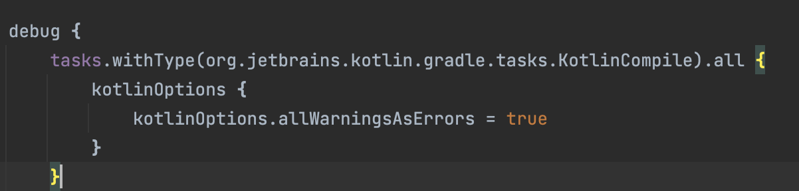
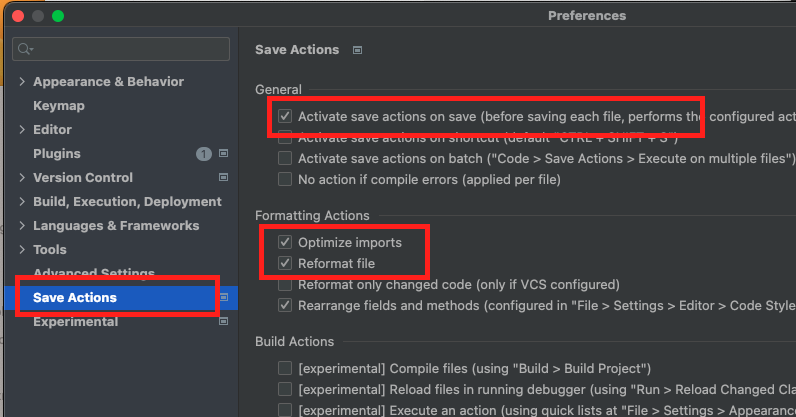

# Kotlin Coding Rules

## Table of Contents
[**1. Naming** ](#1-naming)
- [1.1 Name of files, classes, interfaces.](#1.1)
- [1.2 Names of packages.](#1.2)
- [1.3 Names of functions, properties and local variables.](#1.3)
- [1.4 Names of constants, enum variables.](#1.4)

[**2. Styling** ](#2-styling)
- [2.1 Class layout.](#2.1)
- [2.2 Interface implementation layout.](#2.2)
- [2.3 Class headers.](#2.3)
- [2.4 Named argument.](#2.4)
- [2.5 Expression function.](#2.5)
- [2.6 DONT use semicolons.](#2.6)
- [2.7 Visibility modifiers.](#2.7)

[**3. Comment** ](#3-comment)
- [3.1 Documentation comments.](#3.1)


[**4. Usage** ](#4-usage)

- [4.1 Type alias.](#4.1)
- [4.2 Immutablility.](#4.2)
- [4.3 try, if, and when.](#4.3)
- [4.4 Scope functions.](#4.4)
- [4.5 Non-null values execution.](#4.5)
- [4.6 Data class.](#4.6)


[**5. Zero warnings** ](#5-zero-warnings)

[**6. Format code** ](#6-format-code)

[**Refs** ](#refs)


<p align="right">(<a href="#kotlin-coding-rules">back to top</a>)</p>

## 1. Naming

<table>
<tr id="1.1">
<td width="5%">

**1.1**
</td>
<td width="50%">

Name of files, classes, interfaces use **UpperCamelCase**(capitalize the first letter of each word, including the first) format.
</td>
<td>

```kotlin
MainActivity.kt
```
</td>
</tr>

<tr id="1.2">
<td>

**1.2**
</td>
<td>

Names of packages are always lowercase and do not use underscores. Using multi-word names is generally discouraged, but if you do need to use multiple words, you can either just concatenate them together or use **lowerCamelCase**(capitalize the first letter of each word, except the first which is always lowercase, even if it’s an acronym) format.
</td>
<td>

```kotlin
org.example.project
//or
org.example.myProject
```
</td>
</tr>

<tr id="1.3">
<td>

**1.3**
</td>
<td>

Names of functions, properties and local variables use **lowerCamelCase**(capitalize the first letter of each word, except the first which is always lowercase, even if it’s an acronym) format.
</td>
<td>

```kotlin
fun processDeclarations() { /*...*/ }
var declarationCount = 1
```
</td>
</tr>

<tr id="1.4">
<td>

**1.4**
</td>
<td>

Names of constants, enum variables use **UPPER_CASE_UNDERSCORE**(upper case all letters and separate words with _) format.
</td>
<td>

```kotlin
const val MAX_COUNT = 8

enum class Answer { YES, NO, MAYBE }
```
</td>
</tr>
</table>

<p align="right">(<a href="#kotlin-coding-rules">back to top</a>)</p>

## 2. Styling

<table>
<tr id="2.1">
<td width="5%">

**2.1**
</td>
<td width="50%">

**Class layout**<br>
The contents of a class should go in the following order:
1. Property declarations and initializer blocks
2. Secondary constructors
3. Method declarations
3. Companion object

Do not sort the method declarations alphabetically or by visibility, and do not separate regular methods from extension methods. Instead, put related stuff together, so that someone reading the class from top to bottom can follow the logic of what's happening. <br>
P/S: Constants must be in the top-level property
</td>
<td>

```kotlin
class MainActivity : AppCompatActivity() {
    //Property declarations
    private var name = ""
    
    //Initializer blocks
    init {}

    //Secondary constructors
    constructor(name: String) : this(name) {}

    //Related methods together
    fun changeName(newName: String) {
        name = newName
    }

    fun clearName(){
        name = ""
    }

    //Companion object
    companion object { 
        fun withName(name: String): MainActivity = MainActivity(name)
    }
}
```
</td>
</tr>

<tr id="2.2">

<td>

**2.2**
</td>
<td>

**Interface implementation layout**<br>
When implementing an interface, keep the implementing members in the same order as members of the interface (if necessary, interspersed with additional private methods used for the implementation).
</td>
<td>

```kotlin
interface TestInterface {
    fun hello()
    fun test()
}

class TestClass: TestInterface{
    //good
    override fun hello() {}
    override fun test() {}

    //bad
    override fun test() {}
    override fun hello() {}
}
```
</td>
</tr>

<tr id="2.3">

<td>

**2.3**
</td>
<td>

**Class headers**<br>
Classes with a few primary constructor parameters can be written in a single line. <br>
Classes with longer headers should be formatted so that each primary constructor parameter is in a separate line with indentation. 
</td>
<td>

```kotlin
//few parameters
class Person(id: Int, name: String)

//many parameters
class Person(
    id: Int,
    name: String,
    surname: String
) 

```
</td>
</tr>

<tr id="2.4">
<td>

**2.4**

</td>
<td>
Use the named arguments syntax when a method takes multiple parameters.
</td>
<td>

```kotlin
fun test(x:Int, y:Int, width:Int, height:Int){}

test(x=10, y=10, width= 100, height = 100)
```
</td>
</tr>

<tr id="2.5">
<td>

**2.5**

</td>
<td>

When a function contains only a single expression it can be represented as an **expression function**.
</td>
<td>

```kotlin
//bad
fun toString(): String {
    return "Hey"
}

//good
fun toString(): String = "Hey"

//Read-only properties can use this format
val defaultExtension: String get() = "kt"
```
</td>
</tr>

<tr id="2.6">
<td>

**2.6**
</td>
<td>
Semicolons are dead to us should be avoided wherever possible in Kotlin.
</td>
<td>

```kotlin
val name = "hello";//bad
val name = "hello"//good
```
</td>
</tr>

<tr id="2.7">
<td>

**2.7**
</td>
<td>
Default visibility is public so only include visibility modifiers if you need something other than the default of public.
</td>
<td>

```kotlin
public val wideOpenProperty = 1 //bad
val wideOpenProperty = 1 //good
private val wideOpenProperty = 1 //good
```
</td>
</tr>
</table>

<p align="right">(<a href="#kotlin-coding-rules">back to top</a>)</p>

## 3. Comment
<table>
<tr id="3.1">
<td width="5%">

**3.1**
</td>
<td>

**Documentation comments**<br>
For longer documentation comments, place the opening /** on a separate line and begin each subsequent line with an asterisk. <br>
Short comments can be placed on a single line.
</td>
<td>

```kotlin
/**
 * This is a documentation comment
 * on multiple lines.
 */

/** This is a short documentation comment. */
```
</td>
</tr>
</table>

<p align="right">(<a href="#kotlin-coding-rules">back to top</a>)</p>

## 4. Usage

<table>
<tr id="4.1">
<td width="5%">

**4.1**
</td>
<td width="50%">

If you have a functional type or a type with type parameters which is used multiple times in a codebase, prefer defining a **type alias** for it.
</td>
<td>

```kotlin
typealias MouseClickHandler = (Any, MouseEvent) -> Unit
```
</td>
</tr>

<tr id="4.2">
<td>

**4.2**
</td>
<td>

Prefer using immutable data to mutable. Always declare local variables and properties as **val** rather than **var** if they are not modified after initialization.
</td>
<td>

```kotlin
class ItemPlaceHolder(val bind: RecyclerNoteItemBinding);//good

class ItemPlaceHolder(var bind: RecyclerNoteItemBinding);//bad
```
</td>
</tr>

<tr id="4.3">
<td>

**4.3**
</td>
<td>

Prefer using the expression form of **try**, **if**, and **when**.
</td>
<td>

```kotlin
return if (x) foo() else bar()

if (x)
    return foo()
else
    return bar()

return when(x) {
    0 -> "zero"
    else -> "nonzero"
}

```
</td>
</tr>

<tr id="4.4">
<td>

**4.4**
</td>
<td>

When you call such a function on an object with a lambda expression provided, it forms a temporary scope. In this scope, you can access the object without its name. Such functions are called **scope functions**. There are five of them: **let**, **run**, **with**, **apply**, and **also**. <br>
Scope functions don't introduce any new technical capabilities, but they can make your code more concise and readable. <br>

Scope functions differ by the result they return:
- **apply** and **also** return the context object.

- **let**, **run**, and **with** return the lambda result.
</td>
<td>

```kotlin
val alice = Person("Alice", 20, "Amsterdam").let {
    it.moveTo("London")
}

val alice = Person("Alice").apply {    
    city = 20 // same as this.city = 20
}

val numbers = mutableListOf("one", "two", "three")
val countEndsWithE = numbers.run { 
    add("four")
    add("five")
    count { it.endsWith("e") }
}
//return  number of elements that end with e

with(numbers) {
    val firstItem = first()
    val lastItem = last()        
    println("First item: $firstItem, last item: $lastItem")
}

val numbers = mutableListOf("one", "two", "three")
val string = with(numbers) {
    val firstItem = first()
    val lastItem = last()
    "First item: $firstItem, last item: $lastItem"
}
println(string)//First item: one, last item: three
```
</td>
</tr>

<tr id="4.5">
<td>

**4.5**
</td>
<td>

Use **let** to execute a code block containing non-null values.
</td>
<td>

```kotlin
val str: String? = "Hello"   
processNonNullString(str)// compilation error: str can be null
val length = str?.let { 
    println("let() called on $it")        
    processNonNullString(it) // OK: 'it' is not null inside '?.let { }'
    it.length
}
```
</td>
</tr>

<tr id="4.6">
<td>

**4.6**
</td>
<td>

It is not unusual to create classes whose main purpose is to hold data. In such classes, some standard functionality and some utility functions are often mechanically derivable from the data. In Kotlin, these are called data classes and are marked with **data**.
</td>
<td>

```kotlin
data class User(val name: String, val age: Int);
```
</td>
</tr>
</table>

<p align="right">(<a href="#kotlin-coding-rules">back to top</a>)</p>

## 5. Zero warnings
To make sure all warnings are treated as errors, add below code to app/build.gradle inside key **android** -> **buildTypes** -> **debug**

```bash
tasks.withType(org.jetbrains.kotlin.gradle.tasks.KotlinCompile).all {
    kotlinOptions {
        kotlinOptions.allWarningsAsErrors = true
    }
}
```

<p align="right">(<a href="#kotlin-coding-rules">back to top</a>)</p>

## 6. Format code

Download plugin **Save Actions** then install it in Android Studio.


Restart Android Studio, then active following fields.



<p align="right">(<a href="#kotlin-coding-rules">back to top</a>)</p>

## Refs
- https://kotlinlang.org/docs/coding-conventions.html
- https://developer.android.com/kotlin/style-guide?authuser=1
- https://github.com/kodecocodes/kotlin-style-guide
  
<p align="right">(<a href="#kotlin-coding-rules">back to top</a>)</p>