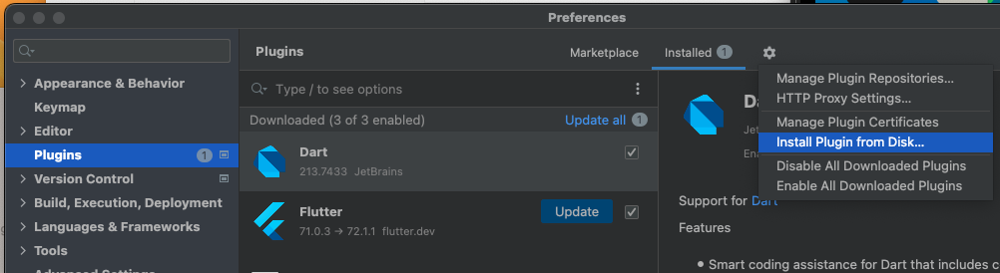

# Kotlin Coding Rules


## Table of Contents
[**1. Naming** ](#1-naming)
- [1.1 Name of files, classes, interfaces.](#1.1)
- [1.2 Names of packages.](#1.2)
- [1.3 Names of functions, properties and local variables.](#1.3)
- [1.4 Names of constants, enum variables.](#1.4)

[**2. Styling** ](#2-styling)
- [2.1 Class layout.](#2.1)
- [2.2 Interface implementation layout.](#2.2)
- [2.3 Class headers.](#2.3)
- [2.4 Named argument.](#2.4)
- [2.5 Expression function.](#2.5)
- [2.6 DONT use semicolons.](#2.6)

[**3. Comment** ](#3-comment)
- [3.1 Documentation comments.](#3.1)

[**5. Auto format on save** ](#5-auto-format-on-save)

[**6. Treat warnings as errors** ](#6-treat-warnings-as-errors)

[**Refs** ](#refs)


## 1. Naming

<table>
<tr id="1.1">
<td width="5%">

**1.1**
</td>
<td width="50%">

Name of files, classes, interfaces use **UpperCamelCase**(capitalize the first letter of each word, including the first) format.
</td>
<td>

```kotlin
MainActivity.kt
```
</td>
</tr>

<tr id="1.2">
<td>

**1.2**
</td>
<td>

Names of packages are always lowercase and do not use underscores. Using multi-word names is generally discouraged, but if you do need to use multiple words, you can either just concatenate them together or use **lowerCamelCase**(capitalize the first letter of each word, except the first which is always lowercase, even if it’s an acronym) format.
</td>
<td>

```kotlin
org.example.project
//or
org.example.myProject
```
</td>
</tr>

<tr id="1.3">
<td>

**1.3**
</td>
<td>

Names of functions, properties and local variables use **lowerCamelCase**(capitalize the first letter of each word, except the first which is always lowercase, even if it’s an acronym) format.
</td>
<td>

```kotlin
fun processDeclarations() { /*...*/ }
var declarationCount = 1
```
</td>
</tr>

<tr id="1.4">
<td>

**1.4**
</td>
<td>

Names of constants, enum variables use **UPPER_CASE_UNDERSCORE**(upper case all letters and separate words with _) format.
</td>
<td>

```kotlin
const val MAX_COUNT = 8

enum class Answer { YES, NO, MAYBE }
```
</td>
</tr>
</table>

## 2. Styling

<table>
<tr id="2.1">
<td width="5%">

**2.1**
</td>
<td width="50%">

**Class layout**<br>
The contents of a class should go in the following order:
1. Property declarations and initializer blocks
2. Secondary constructors
3. Method declarations
3. Companion object

Do not sort the method declarations alphabetically or by visibility, and do not separate regular methods from extension methods. Instead, put related stuff together, so that someone reading the class from top to bottom can follow the logic of what's happening. <br>
P/S: Constants must be in the top-level property
</td>
<td>

```kotlin
class MainActivity : AppCompatActivity() {
    //Property declarations
    private var name = ""
    
    //Initializer blocks
    init {}

    //Secondary constructors
    constructor(name: String) : this(name) {}

    //Related methods together
    fun changeName(newName: String) {
        name = newName
    }

    fun clearName(){
        name = ""
    }

    //Companion object
    companion object { 
        fun withName(name: String): MainActivity = MainActivity(name)
    }
}
```
</td>
</tr>

<tr id="2.2">

<td>

**2.2**
</td>
<td>

**Interface implementation layout**<br>
When implementing an interface, keep the implementing members in the same order as members of the interface (if necessary, interspersed with additional private methods used for the implementation).
</td>
<td>

```kotlin
interface TestInterface {
    fun hello()
    fun test()
}

class TestClass: TestInterface{
    //good
    override fun hello() {}
    override fun test() {}

    //bad
    override fun test() {}
    override fun hello() {}
}
```
</td>
</tr>

<tr id="2.3">

<td>

**2.3**
</td>
<td>

**Class headers**<br>
Classes with a few primary constructor parameters can be written in a single line. <br>
Classes with longer headers should be formatted so that each primary constructor parameter is in a separate line with indentation. 
</td>
<td>

```kotlin
//few parameters
class Person(id: Int, name: String)

//many parameters
class Person(
    id: Int,
    name: String,
    surname: String
) 

```
</td>
</tr>

<tr id="2.4">
<td>

**2.4**

</td>
<td>
Use the named arguments syntax when a method takes multiple parameters.
</td>
<td>

```kotlin
fun test(x:Int, y:Int, width:Int, height:Int){}

test(x=10, y=10, width= 100, height = 100)
```
</td>
</tr>

<tr id="2.5">
<td>

**2.5**

</td>
<td>

When a function contains only a single expression it can be represented as an **expression function**.
</td>
<td>

```kotlin
//bad
fun toString(): String {
    return "Hey"
}

//good
fun toString(): String = "Hey"

//Read-only properties can use this format
val defaultExtension: String get() = "kt"
```
</td>
</tr>

<tr id="2.6">
<td>

**2.6**
</td>
<td>
Semicolons are dead to us should be avoided wherever possible in Kotlin.
</td>
<td>

```kotlin
val name = "hello";//bad
val name = "hello"//good
```
</td>
</tr>
</table>

## 3. Comment
<table>
<tr id="3.1">
<td width="5%">

**3.1**
</td>
<td>

**Documentation comments**<br>
For longer documentation comments, place the opening /** on a separate line and begin each subsequent line with an asterisk. <br>
Short comments can be placed on a single line.
</td>
<td>

```kotlin
/**
 * This is a documentation comment
 * on multiple lines.
 */

/** This is a short documentation comment. */
```
</td>
</tr>
</table>


## 4. Usage

<table>
<tr id="4.1">
<td width="5%">

**4.1**
</td>
<td width="50%">

If you have a functional type or a type with type parameters which is used multiple times in a codebase, prefer defining a **type alias** for it.
</td>
<td>

```kotlin
typealias MouseClickHandler = (Any, MouseEvent) -> Unit
```
</td>
</tr>
</table>

## 5. Auto format on save

Download plugin **Save Actions** then install it in Android Studio.



Restart Android Studio, then active following fields.


## 6. Treat warnings as errors
To make sure all warnings are treated as errors, add below code to app/build.gradle inside key **android** -> **buildTypes** -> **debug**

```bash
tasks.withType(org.jetbrains.kotlin.gradle.tasks.KotlinCompile).all {
    kotlinOptions {
        kotlinOptions.allWarningsAsErrors = true
    }
}
```


## Refs
- https://kotlinlang.org/docs/coding-conventions.html
- https://developer.android.com/kotlin/style-guide?authuser=1
  