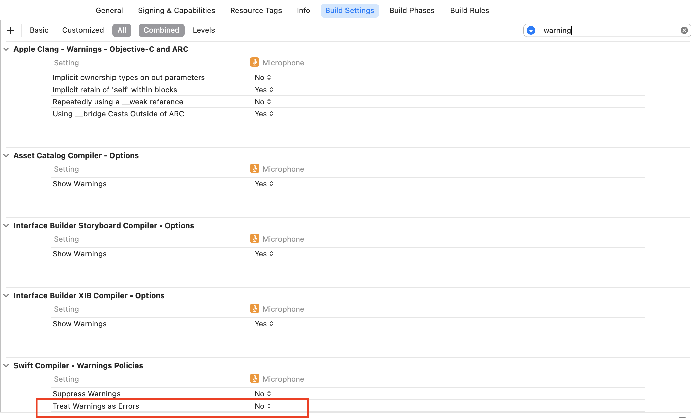
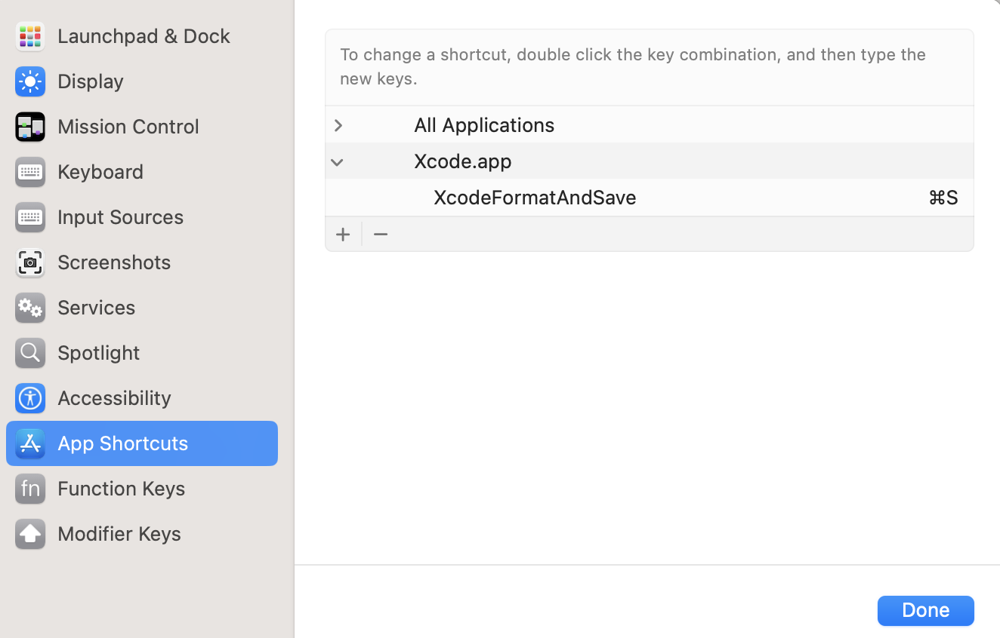
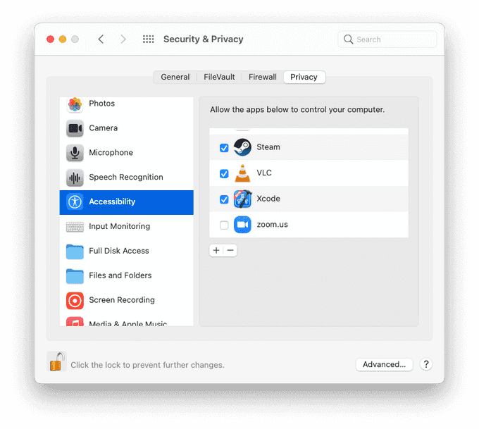

# Swift Coding Rules

## Table of Contents

[**1. Naming** ](#1-naming)
- [1.1 Name of files, classes, protocol, type aliases.](#1.1)
- [1.2 Name of variables, methods, enum variables.](#1.2)
- [1.3 Name of constants.](#1.3)
- [1.4 Generic types.](#1.4)
- [1.5 Name should be redundant.](#1.5)
- [1.6 Protocols.](#1.6)
- [1.7 Restricted access control.](#1.7)
- [1.8 The operation is described by a verb.](#1.8)
- [1.9 The operation is described by a noun.](#1.9)
- [1.10 Omit needless words.](#1.10)
- [1.11 Names should describe their roles.](#1.11)
- [1.12 Boolean methods and properties.](#1.12)
- [1.13 Instances of the declaring type.](#1.13)
  
[**2. Styling** ](#2-styling)
- [2.1 Do not use semicolons.](#2.1)
- [2.2 Get block for a read-only computed property.](#2.2)
- [2.3 Trailing commas.](#2.3)
- [2.4 Parameterized attributes.](#2.4)


[**3. Comment** ](#3-comment)
- [3.1 Documentation comments' format.](#3.1)
- [3.2 Comment should be in brief single-sentence summary.](#3.2)
- [3.3 Use // MARK to group you functions.](#3.3)
  
[**4. Usage** ](#4-usage)
- [4.1 Nameless binding for unnecessary variables.](#4.1)
- [4.2 Closure arguments should all be labeled.](#4.2)
- [4.3 Take advantage of defaulted parameters.](#4.3)
- [4.4 Give properties names for tuple.](#4.4)
- [4.5 Use optional binding to find out whether an optional contains a value.](#4.5)
- [4.6 Exit early.](#4.6)
- [4.7 Representing and Throwing Errors.](#4.7)
- [4.8 Assertions and preconditions.](#4.8)
- [4.9 Memory Safety.](#4.9)
- [4.10 Access Levels.](#4.10)
- [4.11 Define multiple same type variables.](#4.11)
- [4.12 Initializer's arguments.](#4.12)
- [4.13 Avoid sentinel values.](#4.13)

[**5. Zero warnings** ](#5-zero-warnings)

[**6. Format code** ](#6-format-code)

[**Refs** ](#refs)

<p align="right">(<a href="#swift-coding-rules">back to top</a>)</p>

## 1. Naming

<table>
<tr id="1.1">

<td width="5%">

**1.1**
</td>
<td width="50%">

Name of files, classes, protocol, type aliases use **UpperCamelCase** format.
</td>

<td>

```swift

HomeViewController.swift

//HomeViewController with extension functions
HomeViewController+Extensions.swift

class HomeViewController:UIViewController {}

protocol Streamable

typealias MoneyAmount = Double

```
</td>
</tr>

<tr id="1.2">

<td>

**1.2**
</td>
<td>

Name of variables, methods, enum variables use **lowerCamelCase** format.
</td>

<td>

```swift

let studentName = "Hello"
func buttonClicked(_ sender: UIButton?) {}

public enum HTTPStatus: Int {
  case ok = 200
  case badRequest = 400
}
```
</td>
</tr>

<tr id="1.3">
<td>

**1.3**
</td>
<td>

Name of constants **SHOULD** use **UPPER_CASE_UNDERSCORE** format.
</td>

<td>

```swift
let TIMEOUT_SECONDS = 2

```
</td>
</tr>

<tr id="1.4">
<td>

**1.4**
</td>
<td>

Generic types should start with letter **T**, then **U, V** and so on. You can use different names to make usage of generics more clear.

</td>

<td>

```swift


public struct GenericStructure<T> {}

public struct ExtendStructure<Int> {}

```
</td>
</tr>

<tr id="1.5">
<td>

**1.5**
</td>
<td>

Names should be short and meaningful, **DON'T** use the misunderstanding names.

</td>

<td>

```swift
let max = 3;// Bad
let maximumItemsCount = 3;// Good 👍

let i = 0;// Bad
let studentIndex = 0;// Good 👍
```
</td>
</tr>

<tr id="1.6">
<td>

**1.6**
</td>
<td>

**Protocols** <br>
When picking a protocol name, always consider what your protocol is about.
</td>
<td>

```swift
//If it declares that type can be something else, 
//use Convertible as suffix
protocol JSONConvertible {}
protocol APIFilterConvertible {}

//If your protocol defines an action or capability, 
//use -able or -ible as suffix
protocol Streamable {}
protocol Mappable {}
protocol MemberContentVisible {}

//If your protocol serves as a data source or a delegate, 
//use with DataSource or Delegate as suffix.
protocol TableDataSource{}
```
</td>
</tr>

<tr id="1.7">
<td>

**1.7**
</td>
<td>
Restricted access control (internal, fileprivate, or private) is preferred for the purposes of hiding information from clients, rather than naming conventions.
</td>
<td>

```swift
private let _name:String // Bad
private let name:String // Good 👍
```
</td>
</tr>

<tr id="1.8">
<td>

**1.8**
</td>
<td>

When the operation is **described by a verb**, use the verb’s imperative for the mutating method and apply the "ed" or "ing" suffix to name its nonmutating counterpart.
</td>
<td>

```swift
//Mutating
x.sort()
x.append(y)

//Nonmutating
z = x.sorted()
z = x.appending(y)
```
</td>
</tr>

<tr id="1.9">
<td>

**1.9**
</td>
<td>

When the operation is **described by a noun**, use the noun for the nonmutating method and apply the "form" prefix to name its mutating counterpart.
</td>
<td>

```swift
//Nonmutating
x = y.union(z)	
j = c.successor(i)	

//Mutating
y.formUnion(z)
c.formSuccessor(&i)
```
</td>
</tr>

<tr id="1.10">
<td>

**1.10**
</td>
<td>

**Omit needless words.**<br>
Every word in a name should convey salient information at the use site.
</td>
<td>

```swift
// Bad
func removeElement(_ member: Element) -> Element?
allViews.removeElement(cancelButton)

// Good 👍
func remove(_ member: Element) -> Element?
allViews.remove(cancelButton) 
```
</td>
</tr>

<tr id="1.11">
<td>

**1.11**
</td>
<td>

**Name variables, parameters, and associated types according to their roles**, rather than their type constraints.
</td>
<td>

```swift
var string = "Hello" // Bad
var name = "Hello" // Good 👍

protocol ViewController {
  associatedtype ViewType : View // Bad  
  associatedtype ContentView : View // Good 👍 
}

class ProductionLine {
  func restock(from widgetFactory: WidgetFactory)// Bad  
  func restock(from supplier: WidgetFactory)// Good 👍 
}

```
</td>
</tr>

<tr id="1.12">
<td>

**1.12**
</td>
<td>

Uses of Boolean methods and properties should read as assertions about the receiver.
</td>
<td>

```swift
var isEmpty:Boolean
func contains(subString:String):Boolean{}

```
</td>
</tr>

<tr id="1.13">
<td>

**1.13**
</td>
<td>

Static and class properties that return instances of the declaring type are **not suffixed** with the name of the type.
</td>
<td>

```swift
public class UIColor {
  public class var redColor: UIColor {}// Bad
  public class var red: UIColor {}// Bad
}
```
</td>
</tr>
</table>

<p align="right">(<a href="#swift-coding-rules">back to top</a>)</p>

## 2. Styling

<table>
<tr id="2.1">
<td width="5%">

**2.1**
</td>
<td width="50%">
Do not use semicolons at end of the line.
</td>
<td>

```swift
let name = "hello"; // Bad
let name = "hello" // Good 👍
```
</td>

<tr id="2.2">
<td>

**2.2**
</td>
<td>
The get block for a read-only computed property is omitted and its body is directly nested inside the property declaration.
</td>
<td>

```swift
// Bad
var totalCost: Int {
  get {
    return items.sum { $0.cost }
  }
}

// Good 👍
var totalCost: Int {
  return items.sum { $0.cost }
}
```
</td>
</tr>

<tr id="2.3">
<td>

**2.3**
</td>
<td>

Trailing commas in array and dictionary literals are required when each element is placed on its own line.
</td>
<td>

```swift
let configurationKeys = [
  "bufferSize",
  "compression",
  "encoding"// Bad
]

let configurationKeys = [
  "bufferSize",
  "compression",
  "encoding",// Good 👍
]

```
</td>
</tr>

<tr id="2.4">
<td>

**2.4**
</td>
<td>
Parameterized attributes (such as @availability(...) or @objc(...)) are each written on their own line immediately before the declaration to which they apply.
</td>
<td>

```swift
// Bad
@available(iOS 9.0, *) public func coolNewFeature() {}

// Good 👍
@available(iOS 9.0, *)
public func coolNewFeature() {}
```
</td>
</tr>
</table>

<p align="right">(<a href="#swift-coding-rules">back to top</a>)</p>

## 3. Comment

<table>
<tr id="3.1">
<td width="5%">

**3.1**
</td>
<td width="50%">
Documentation comments are written using the format where each line is preceded by a triple slash (///). Javadoc-style block comments (/** ... */) are not permitted.
</td>
<td>

```swift
/// Return numeric value from a string
func numericValue(of string: String) -> Int {
  // ...
}
```
</td>
</tr>

<tr id="3.2">
<td>

**3.2**
</td>
<td width="50%">
Comments begin with a brief single-sentence summary that describes the declaration.<br>
(This sentence may span multiple lines, but if it spans too many lines, the author should consider whether the summary can be simplified and details moved to a new paragraph.)
</td>
<td>

```swift
// Bad
/// This property is the background color of the view.
var backgroundColor: UIColor

// Good 👍
/// The background color of the view.
var backgroundColor: UIColor
```
</td>
</tr>

<tr id="3.3">
<td>

**3.3**
</td>
<td>

Use **// MARK:** is strongly advised to group your functions, properties,.. as a logical order, which will be helpful for readers and future writers (including yourself). <br>
These comments are also interpreted by Xcode and provide bookmarks in the source window’s navigation bar.
</td>
<td>

```swift
// MARK: - View controller lifecycle methods
override func viewDidLoad() {}

override func viewWillAppear(_ animated: Bool) {}

// MARK: - User actions
@objc private func shareButtonClicked(_ sender: UIButton?) {}

@objc private func saveButtonClicked(_ sender: UIButton?) {}
```
</td>
</tr>

</table>

<p align="right">(<a href="#swift-coding-rules">back to top</a>)</p>

## 4. Usage
<table>
<tr id="4.1">
<td width="5%">

**4.1**
</td>
<td width="50%">
If you don't need a variable, use nameless binding.
</td>
<td>

```swift
_ = methodThatReturnsUnusedVariable()
```
</td>
</tr>

<tr id="4.2">
<td>

**4.2**
</td>
<td>

If a function call has multiple closure arguments, all arguments **SHOULD** be labeled.
</td>
<td>

```swift
// Bad
UIView.animate(
  withDuration: 0.5,
  animations: {
    // ...
  }) { finished in
    // ...
  }

// Good 👍
UIView.animate(
  withDuration: 0.5,
  animations: {
    // ...
  },
  completion: { finished in
    // ...
  })
```
</td>
</tr>

<tr id="4.3">
<td>

**4.3**
</td>
<td>

**Take advantage of defaulted parameters** when it simplifies common uses. Any parameter with a single commonly-used value is a candidate for a default.
</td>
<td>

```swift
// Bad
let order = lastName.compare(
  royalFamilyName, options: [], range: nil, locale: nil)

// Good 👍
let order = lastName.compare(royalFamilyName)
```
</td>
</tr>

<tr id="4.4">
<td>

**4.4**
</td>
<td>

When using **tuple**, we should give properties names for visualization.
</td>
<td>

```swift
// Bad
let company = ("Programiz App", 2.1)
let product = company.0 //need to explain what index 0 stand for

// Good 👍
let company = (product: "Programiz App", version: 2.1)
company.product //no need more explaination
```
</td>
</tr>

<tr id="4.5">
<td>

**4.5**
</td>
<td>

You use **optional binding** to find out whether an optional contains a value, and if so, to make that value available as a temporary constant or variable.
</td>
<td>

```swift
let name:String? = nil
if let name {}
```
</td>
</tr>

<tr id="4.6">
<td>

**4.6**
</td>
<td>When you have to meet certain criteria to continue execution, try to exit early.</td>
<td>

```swift
let flag = true

// Bad
if flag {
  // long code for true
}
else {
  // long code for false
}

// Good 👍
if !flag {
  // long code for false
  return
}
// long code for true
```
</td>
</tr>

<tr id="4.7">
<td>

**4.7**
</td>
<td>

**Representing and Throwing Errors**<br>
Throwing an error lets you indicate that something unexpected happened and the normal flow of execution can’t continue. You use a throw statement to throw an error.
</td>
<td>

```swift
enum SandwichError: Error {
  case invalidSelection
  case missingIngredients(ingredients: Int)
  case outOfCleanDishes
}

func makeASandwich(){
  guard let cleanDishes == 0 else {
    throw SandwichError.outOfCleanDishes
  }

  let requiredIngredients = 10
  guard let ingredients < requiredIngredients else {
    let missingIngredients = requiredIngredients - ingredients
    throw SandwichError.missingIngredients(missingIngredients)
  }

}

do {
    try makeASandwich()
} catch SandwichError.outOfCleanDishes {
    washDishes()
} catch SandwichError.missingIngredients(let ingredients) {
    buyGroceries(ingredients)
}
```
</td>
</tr>

<tr id="4.8">
<td>

**4.8**
</td>
<td>

**Assertions** and **preconditions** are checks that happen at runtime.<br>
You use them to make sure an essential condition is satisfied before executing any further code. If the Boolean condition in the assertion or precondition evaluates to true, code execution continues as usual. <br><br>
If the condition evaluates to false, the current state of the program is invalid; code execution ends, and your app is terminated so use it with your **risks**.<br><br>
The difference between assertions and preconditions is in when they’re checked: Assertions are checked only in **debug** builds, but preconditions are checked in both **debug** and **production** builds. In production builds, the condition inside an assertion isn’t evaluated.

</td>
<td>

```swift
let age = -3
// This assertion fails because -3 isn't >= 0.
assert(age >= 0, "A person's age can't be less than zero.")

// In the implementation of a subscript...
precondition(index > 0, "Index must be greater than zero.")
```
</td>
</tr>

<tr id="4.9">
<td>

**4.9**
</td>
<td>

**Memory Safety**<br>
A conflicting access to memory can occur when different parts of your code are trying to access the same location in memory at the same time. Multiple accesses to a location in memory at the same time can produce unpredictable or inconsistent behavior.


</td>
<td>

```swift
//for exam
var stepSize = 1
func increment(_ number: inout Int) {
    number += stepSize
}

increment(&stepSize)
// Error: conflicting accesses to stepSize
// stepSize is a global variable, 
// and it’s normally accessible from within increment(_:)
// Solving this by making an explicit copy of stepSize:
var copyOfStepSize = stepSize
increment(&copyOfStepSize)
stepSize = copyOfStepSize // stepSize is now 2
```
</td>
</tr>

<tr id="4.10">
<td>

**4.10**
</td>
<td>

**Access Levels**<br>
Swift provides five different access levels for entities within your code.
- **Open** or **public** access enable entities to be used within any source file from their defining module.
- **Internal** access enables entities to be used within any source file from their defining module, but not in any source file outside of that module.
- **File-private** access restricts the use of an entity to its own defining source file.
- **Private** access restricts the use of an entity to the enclosing declaration, and to extensions of that declaration that are in the same file.
</td>
<td>

```swift
public class SomePublicClass {}
internal class SomeInternalClass {}
fileprivate class SomeFilePrivateClass {}
private class SomePrivateClass {}
```
</td>

<tr id="4.11">
<td>

**4.11**
</td>
<td>

You should define multiple related variables of the same type on a single line, separated by commas, with a single type annotation after the final variable name;
</td>
<td>

```swift
// Bad
var red: Double
var green: Double
var blue: Double

// Good 👍
var red, green, blue: Double
```
</td>
</tr>

<tr id="4.12">
<td>

**4.12**
</td>
<td>
For clarity, initializer arguments that correspond directly to a stored property have the same name as the property. Explicit self. is used during assignment to disambiguate them.
</td>
<td>

```swift
public struct Person {
  public let name: String
  public let phoneNumber: String

  // Bad
  public init(name _name: String, phoneNumber _phoneNumber: String) {
    name = _name
    phoneNumber = _phoneNumber
  }

  // Good 👍
  public init(name: String, phoneNumber: String) {
    self.name = name
    self.phoneNumber = phoneNumber
  }  
}
```
</td>
</tr>

<tr id="4.13">
<td>

**4.13**
</td>
<td>
Sentinel values are avoided when designing algorithms (for example, an “index” of −1 when an element was not found in a collection).
</td>
<td>

```swift
// Bad
func index(of thing: Thing) -> Int {
  // ...
}

let index = index(of: thing)
if index != -1 {
  // Found it.
} else {
  // Didn't find it.
}

// Good 👍
func index(of thing: Thing) -> Int? {
  // ...
}
if let index = index(of: thing) {
  // Found it.
} else {
  // Didn't find it.
}
```
</td>
</tr>

</table>

<p align="right">(<a href="#swift-coding-rules">back to top</a>)</p>

## 5. Zero warnings
Code should compile without warnings when feasible. Any warnings are able to be removed easily by the author must be removed.<br>
In Xcode, enable **Treat Warnings as Errors** in Build-Settings.


<p align="right">(<a href="#swift-coding-rules">back to top</a>)</p>

## 6. Format code
Install **SwiftFormat** for Xcode. Run the below commands:

```bash
brew install swiftformat
brew install --cask swiftformat-for-xcode
open "/Applications/SwiftFormat For Xcode.app"
```

- Open **Automator** app, and and create a **Quick Action** with **Workflow receives** is no input, in **Xcode.app**.
- Add **Run AppleScript**,  and pastes following code:
```bash
on run {input, parameters}
	tell application "System Events"
		tell process "Xcode"
			set frontmost to true
			if menu item "Format File" of menu of menu item "SwiftFormat" of menu "Editor" of menu bar 1 exists then
				click menu item "Format File" of menu of menu item "SwiftFormat" of menu "Editor" of menu bar 1
			end if
			click menu item "Save" of menu "File" of menu bar 1
		end tell
	end tell
	return input
end run
```
- Run then save script as name **XcodeFormatAndSave**.
- Open **System Preferences** app, choose **Keyboard** and pick the **Shortcuts** tab. On the sidebar, select **App Shortcuts**.
- Add a new shortcut, the **Application** is **XCode**, the **Menu Title** is the name of our Quick Action (**XcodeFormatAndSave**), and the **Keyboard Shortcut** is **Cmd+S**.



- Actually, it will probably throw an error. This action needs **Accessibility** permissions, so you will need to navigate to **System Preferences** > **Security & Privacy** and give permission to Xcode.



Refs: https://luisramos.dev/xcode-format-and-save

<p align="right">(<a href="#swift-coding-rules">back to top</a>)</p>

## Refs
- https://www.swift.org/documentation/api-design-guidelines/
- https://google.github.io/swift

<p align="right">(<a href="#swift-coding-rules">back to top</a>)</p>